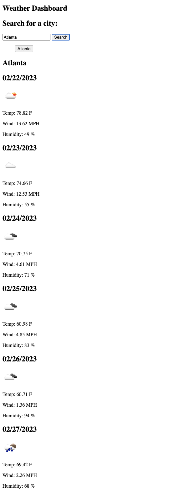
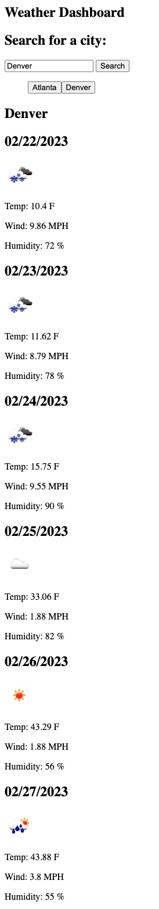

# Weather Dashboard

## Link to deployed application
https://alimomin7861.github.io/weather-dashboard/

## Visual Representation

## Overview 
The purpose of this project was to create a weather dashboard application that allows a user to get the current weather and the five day forecast for a given city via the 5 Day Weather Forecast API. The searched city is also added to a search history list where the user can see what cities they have searched previously. The cities in the search history are also clickable to pull in their current weather & five day weather forecast. 

